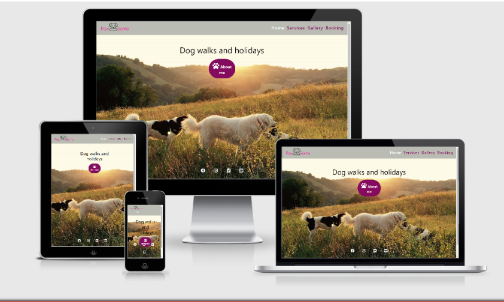
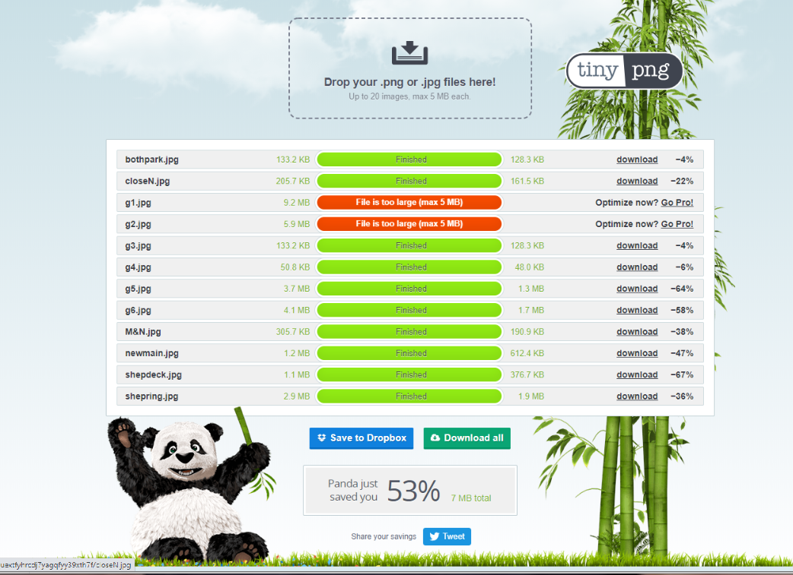
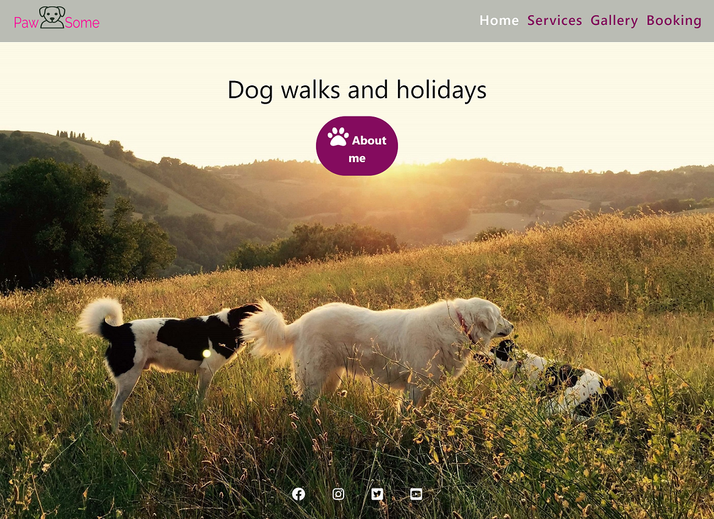
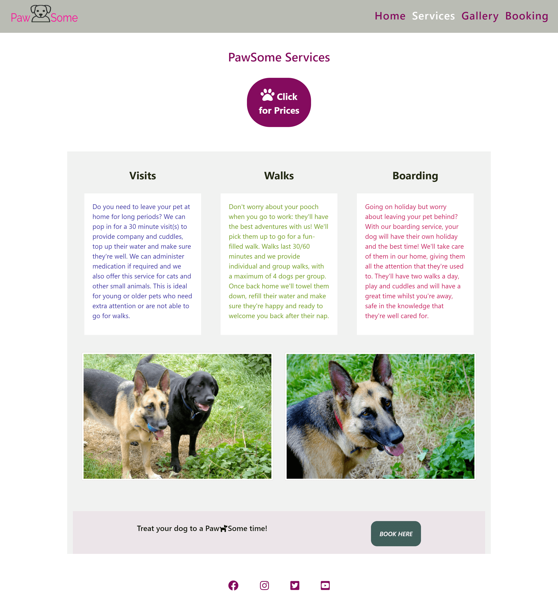
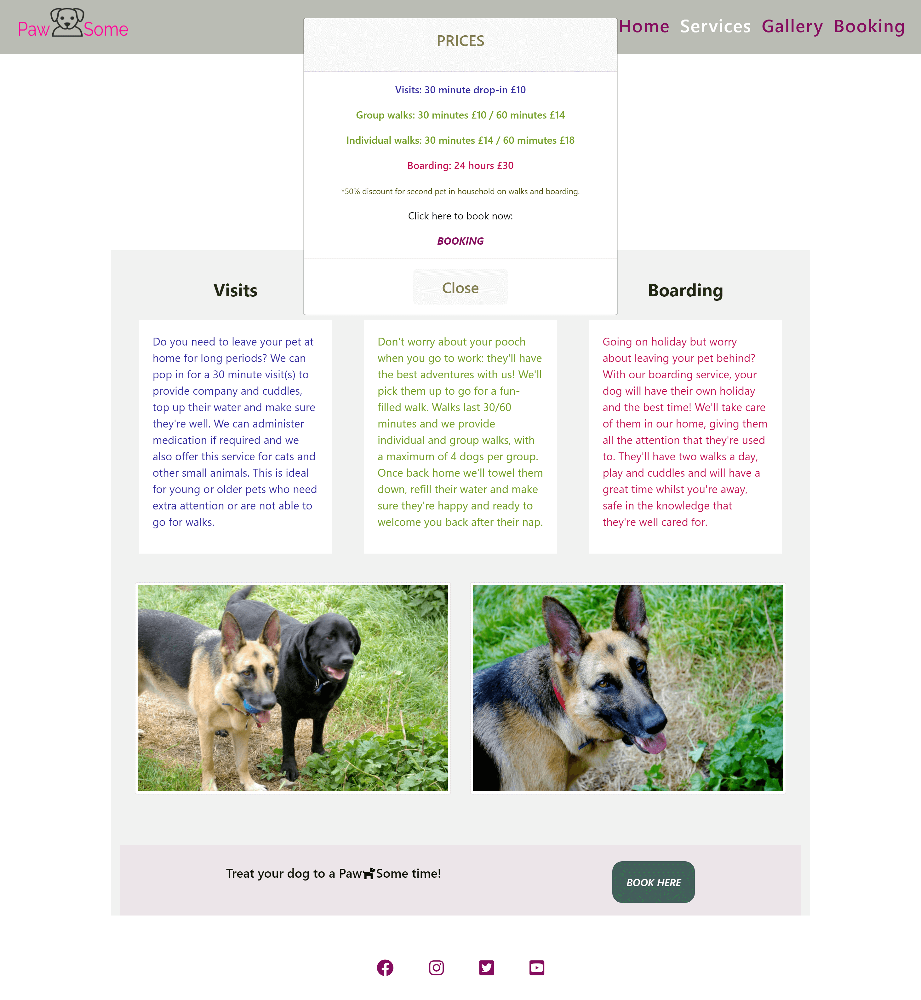
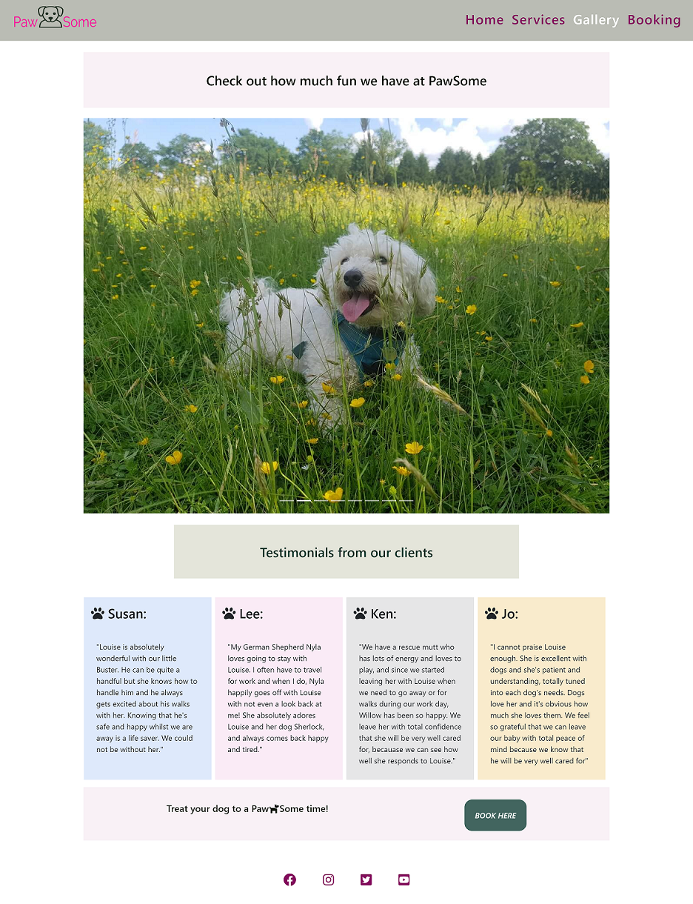
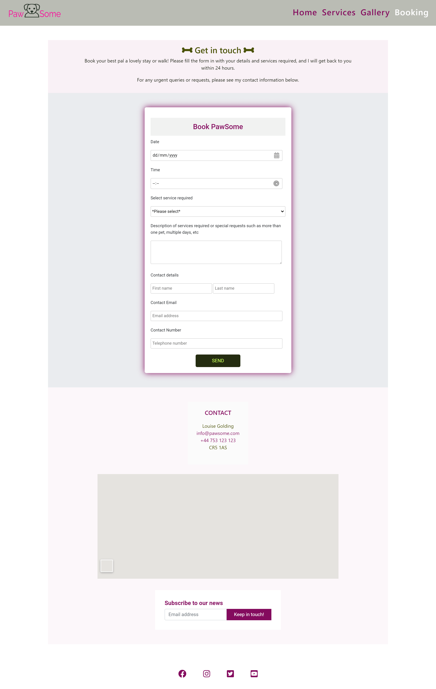
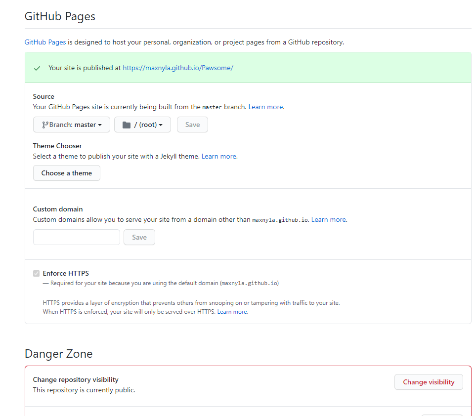

<

  

# Table of Contents 
1. [Introduction](#introduction)
2. [UX](#ux)
3. [Wireframe](#wireframe)
4. [Visual Identity](#visualidentity)    
5. [Site Overview](#siteoverview)
6. [User Stories](#userstories)
7. [Testing](#testing)
8. [Deployment](#deployment)
9. [Code Validation](#codevalidation)
10. [Technologies](#technologies)
11. [Media](#media)
9. [Acknowledgements and thanks](#acknowledgements)

## Introduction 

*Note: This site portrays a fictitious business, created purely for the purpose of this exercise. 
This will be my first Milestone Project for the Code Institute Diploma in Full Stack Development*

PawSome is a pet services company, offering dog walking and boarding services as well as home visits in the customer's home.
It was created by a dog owner who understands how difficult it is to leave your four legged family member behind when you need 
to be away for a long time. It's vital to know that your pet will be well taken care of and in safe hands, which is what
this site is trying to convey and offer.

## UX 

My aim was to have a clean, uncluttered and responsive site with a very simple home page where the main feature is a relevant and scenic background photo
that covers the full viewport and sets the tone for the rest of the site. 
The goal is to showcase the services offered and use bright, happy colours that are also close to nature. 
The header and footer design carries through the site on all pages for continuity. 
 
- **Home page:**

The home page design is very simple: the main feature is a relevant and scenic background photo
that covers the full viewport. The goal is to showcase the services offered and use bright, happy colours that are also close to nature yet not garish or too 'in your face'.
In the center is a jumbotron that includes an 'About Me' section which is accessed through a modal window. Within the modal popup is a link to
the booking section and also a link to the Services section. I like the fact that the site has many sections interlinked from different places, 
as I feel that it makes it more accessible.

- **Services page:**

The simple and responsive layout is achieved by using a grid system with different areas for a list of the 
services offered and also some photos to enhance the visual experience. The prices section can be accessed as 
a separate modal which opens in a new pop-up window and there is a link to the booking section from the bottom of the page as well as from the prices section.

- **Gallery page:**

The main feature of the gallery page is an image carousel which is, again, inside a grid system. This also includes 
an area with testimonies from customers that have used the business. At the bottom of the page is a link to the booking section of the website.

- **Booking page:**

The booking page follows the theme with a grid system, which includes some information with contact details and a map as well as a
booking form. The contact details include a telephone number and email address that can be clicked through for a seamless experience.
There is also a form where clients can submit a request to receive the company newsletter.

Due to having a few large images on the site which took long to load and for the purpose of improving user experience, I have compressed the images using [tinypng.com](https://tinypng.com/) 
Total reduction in image size has been 53% (7MB).

:house:[ Table of Contents](#home)

## Wireframe 

The wireframe was designed using [Microsoft Paint](https://jspaint.app/)
I created two wireframes for each html page, one for the mobile view and another for the desktop view. 
I didn't want to change the design for the different pages unless it was totally necessary becuse of viewing limitations so I stuck to the same structure as much as possible.

* Below is a link to all my wireframes:

[wireframes for MS1 PawSome](https://github.com/maxnyla/Pawsome/tree/master/assets/wireframes)

:house:[ Table of Contents](#home)

## Visual Identity 

- [LogoMakr](https://logomakr.com/) was used for the logo design. 
    For the logo, I wanted to use an image of a dog but make it a friendly, cartoon-like character to give the page a playful flair.

As for the website itself, I wanted to use colour as a prop so I used it to visually differentiate and separate areas as well as for continuity. 
For example, the Services page has the text for the three different services in different colours which then match the prices for each service. The modal buttons have the same colour scheme as well as the same icon, and 
the form buttons are also very similar.

Another way in which I used colour to unify things around the site was the hover behaviour with links. I set all links to change to the same bright green colour when hovered on/clicked and also the modal buttons. 
With regards to the navigation links, in addition to the colour I also set these to briefly change to italics for added effect.

I also wanted to keep the site visual identity unified by using the same header and footer for all the pages. The only exception to this is the home page, where the colours of the footer social media icons are reversed.
This is due to the fact that the magenta colour used on the other pages does not look bright or distinguishable enough over the background photo and I liked the effect of the white text better.

:house:[ Table of Contents](#home)

### Site overview 

Below are a series of images showing an overview of the site:

:house:[ Table of Contents](#home)

## User Stories 

**Users:**

- As a user, I'd like to get a feel for the sort of person the business owner is, to ascertain if I can trust them
with the care of my dogs and, potentially, access to my home.
- As a user, I'd like to see the location of the business and the areas covered by them.
- As a user, I'd like to see the different types of services that the business offers, including full pricing details.
- As a user, I'd like to see photos and social media posts showing the business as it operates on a daily basis.
- As a user, I'd like to see reviews by other customers.
- As a user, I'd like to be able to book online without needing to make a phone call.
- As a user, I'd like to be able to click the contact number and email to contact the business straight away if I so wish.

**PawSome business owner:**

- As a business owner, I'd like to show potential customers that they can trust me with their pets. Since I am a dog owner
myself, I know how important the trust factor is. This is achieved through the information in the 'About Me' section.
- As a business owner, I'd like for potential customers to have a very clear idea of all the services I offer and pricing,
as well as the areas covered.
- As a business owner, I want to offer customers the possibility of sending a booking enquiry via the site. 
- As a business owner, I'd like to share a glimpse of our life through our social media posts.
- As a business owner, it's important to me that any user or potential customer viewing the site has the best experience and is able to easily access all the relevant sections with one click.

:house:[ Table of Contents](#home)

## Testing 

This website has been tested through the GTMetrix site, [GTmetrix](https://gtmetrix.com/reports/maxnyla.github.io/EKEXs42Q).
Below is a screenshot of the results achieved. Page speed score was 94% and the time to fully load the site was 1.7s.

**Demo/Testing**

I have deployed the site on a number of occasions throughout the building process, so that I could test it from different devices such as my mobile and tablet and check for responsiveness.

During this testing I realised that I had to make some design changes to areas that I was not satisfied with, as the viewing experience on the mobile devices was not great.
I have therefore made many changes as I went along in order to make it more responsive or easier to navigate.
Some of these changes are broken down below:

- I had initially started with a footer which included a newsletter form. This was on the left of the screen and the social media icons were on the right.
As the project progressed, I thought that it was unnecessary to have the newsletter on every page and that it detracted from my aim of a streamlined site, so I removed it and only left the social media icons.
I then re-positioned these to have a central position in the footer, as I find it more pleasant visually.

- I had originally not intended to have clickable links within the 'About Me' and 'Prices' modals, but as I tested the site I realised that it could be a useful feature. 
I shared the site with some friends and family who agreed that it would be nice to have, so I decided to include these. The challenges then were that I had to modify my elements becauase I had initially created a simple button with just an anchor tag in it but the code validator instructed me to change it.

- Another challenge that presented itself was with the Services page, as the central services column text was shorter than the other two columns when the site was viewed at large mobile/tablet view. I had to change the text a bit to accommodate this and also change the column size to break into the mobile view at a different point in order to resolve it.

- A recurrent problem/bug which I have not managed to resolve satisfactorily is the height of the home page (index html). I really wanted the background photo to take up the full height of the screen and absorb the text from the footer and this works, but it then also creates a vertical scrollbar due to overflow.
All my attempts to fix this have failed because if I resolved the overflow problem I then ended up with an issue with the footer icons moving around and/or a white band at the bottom of the page. In the end, I figured that it caused the least disruption to the site to leave the overflow as it was.

- I have tested the code on  different browsers (Chrome, Firefox, Edge, Opera, Safari) and on different devices such as mobile, tablet, laptop and large desktop.

In other instances, I have simply changed things around because I thought that they looked nicer or worked better.

## Deployment 

**Deployment**

This website has been deployed to GitHub Pages as [PawSome](https://maxnyla.github.io/Pawsome)

The process for deployment is documented below:

- Log into [GitHub](https://www.github.com)

- Access the page with the repository for this project (https://github.com/maxnyla/Pawsome)

- Click on 'Settings' on the main menu over the file listing

- Navigate down to 'GitHub Pages'

- Select 'Branch: Master' from the menu

- This generates a live link for the website, which is now viewable publicly

:house:[ Table of Contents](#home)

### Code validation 

I ran all my code through the  [W3C Markup Validation Service](https://validator.w3.org) and the [CSS Validation Service](https://jigsaw.w3.org/css-validator)

This gave me a few errors that required changing. Some of them were related to outdated webkit extensions, others to typos in the code and others had to do with incorrectly nested elements. I found a way around these and corrected the code so that the validation completed without errors or warnings.

Links to the results of the last validation completed can be found below:

[Home Page](assets/code_validation/1-index_html_validation.png)

[Services](assets/code_validation/2-services_html_validation.png)

[Gallery](assets/code_validation/3-gallery_html_validation.png)

[Booking](assets/code_validation/4-booking_html_validation.png)

[CSS](assets/code_validation/5-css_validation.png)

## Technologies 

Technologies used on this project are basically [HTML5](https://en.wikipedia.org/wiki/HTML5) and [CSS3](https://en.wikipedia.org/wiki/CSS) for the build, in addition to which I have used the below.

- [Gitpod](https://www.gitpod.io)
    Since I am typing this text through Gitpod, I figured it would go first in the list. All code was created through Gitpod and the workspace for this project resides there.

- [GitHub](https://www.github.com)
    This has been used to host and deploy the project.

- [Bootstrap](https://getbootstrap.com)
    Used for their grid system, navbars, modals, carousel, etc. I have relied heavily on Bootstrap elements although I have on many occasions modified it for styling purposes.

- [FontAwesome](https://fontawesome.com)
    Used for their great icons, which I have used on most if not all my pages.

- [Cloudflare](https://www.cloudflare.com) 
    Used for the scripts

- [Google APIs](https://www.googleapis.com) 
    Used for the map

- [Code Beautify CSS beautifier](https://codebeautify.org)
    Used to make my CSS look nicer and tidier

- [Beautify Tools HTML beautifier](http://beautifytools.com/html-beautifier.php)
    Used to make my HTML tidier 

- [W3C Markup Validation Service](https://validator.w3.org)
    Used to check my HTML code
    
- [CSS Validation Service](https://jigsaw.w3.org/css-validator)
    Used to check my CSS code

I must also mention the Chrome Developer Tools, as I have used them extensively throughout the project. They have been very useful for each change that I made, and to double-check my ideas before implementing them.

:house:[ Table of Contents](#home)

## Media 

I have taken advantage of several useful resources for images and my logo. Please see below:

- [Logo Makr](https://logomakr.com/) 
    for the logo design.

- [Unsplash](https://unsplash.com) 
    for some of the images, although most of the images used were my own and feature my present and past dogs.

- [Font Awesome](https://fontawesome.com/6?next=%2Fstart) 
    for the icons used on this project.

- [Am I Responsive](http://ami.responsivedesign.is/) 
    for the image used in the UX section showing the different screen sizes.

- [Favicon](https://www.favicon.io)
    for the thumbnail icon on the internet tab header

## Acknowledgements and thanks 

I would like to mention all the different resources and sites that are out there, with their respective communities, which have been a huge help for me. 
I will list some of them below:

- Bootstrap
- Git Hub and Git Pod
- Font Awesome
- jQuery developers
- Unsplash.com
- LogoMakr
- Stack Overload
- Slack 
- Google (for all the things that I've looked up during this project, which have led me to all these amazing sites)

And lastly, I could not leave out the Code Institute team: the other students on Slack, the tutor support and all the mentors who are always welcoming and trying to help, 
and of course my mentor Felipe Souza Alarcon for all his help and ideas during this project, and his flexibility and availability. 

:house:[ Table of Contents](#home)
